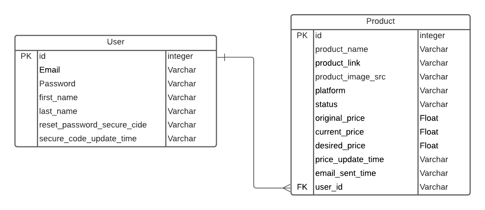

# **Overview**
This is the backend for Trackky, a price drop alert web app.\
For frontend, please refer to [Trackky_frontend](https://github.com/Jocelyn59435/Trackky_frontend).
## **1. Link**
https://trackkybackend.herokuapp.com/graphql
## **2. Status Badge**
[](https://github.com/Jocelyn59435/Trackky_backend/actions/workflows/CD.yml)
## **3. Main Tech Stacks**
- Express
- TypeGraphql
- Knex
- Postgres

## **4. NPM Scripts**
- `npm run migrate`: Set up tables on the database with Knex
- `npm run dev`: Start the project with ts-node.
- `npm run start`: Build and start the project with the built bundle.
- `npm run lint`: to lint 
- `npm run build`: Compile typescript to js
- `npm run test`: run tests
- `npm run generate`: Generate code from GraphQL schema and operations
## **5. App Dependencies**
### **dependencies**
- "apollo-server-express": "^2.25.2",
- "bcrypt": "^5.0.1",
- "class-validator": "^0.13.1",
- "dotenv": "^10.0.0",
- "express": "^4.17.1",
- "graphql": "^15.5.1",
- "jsonwebtoken": "^8.5.1",
- "knex": "^0.21.21",
- "nodemailer": "^6.6.5",
- "pg": "^8.7.1",
- "puppeteer": "^10.2.0",
- "randomstring": "^1.2.1",
- "reflect-metadata": "^0.1.13",
- "type-graphql": "^1.1.1"

### **devDependencies**
- "@types/bcrypt": "^5.0.0",
- "@types/jest": "^27.0.1",
- "@types/jsonwebtoken": "^8.5.4",
- "@types/node": "^16.6.0",
- "@types/nodemailer": "^6.4.4",
- "@types/puppeteer": "^5.4.4",
- "@types/randomstring": "^1.1.7",
- "@types/ws": "^7.4.7",
- "@typescript-eslint/eslint-plugin": "^4.33.0",
- "@typescript-eslint/parser": "^4.33.0",
- "eslint": "^7.32.0",
- "jest": "^27.0.6",
- "nodemon": "^2.0.12",
- "prettier": "^2.3.2",
- "ts-jest": "^27.0.5",
- "ts-node": "^10.2.0",
- "typescript": "^4.3.5"


## **6. Database**

Tables including `user_info` and `product` are defined by [knex migration file.](./migrations/20210812121754_build_user_product_table.ts)

Database Connection is defined in [knexfile.ts.](./knexfile.ts)
## **7. GraphQL Schema**
### **Entities:** 
- [user_info](./src/graphql/entities/user_info.ts)
- [product](../trackky_backend/src/graphql/entities/product.ts)
### **Resolvers:**
- [auth_resolver](./src/graphql/resolvers/auth_resolver.ts)
  - signUp()
  - signIn()
  - resetPassword()
  - resetPasswordRequest()
  - checkSecureCode()


- [product_resolver](./src/graphql/resolvers/product_resolver.ts)
  - checkProductPriceByUrl()
  - addProduct()
  - deleteProduct()
  - updateDesiredPrice()


- [user_info_resolver](./src/graphql/resolvers/user_info_resolver.ts)
  - getUserInfo()

## **8. Authorization**
[verifyAuthToken.ts](./src/middlewares/verifyAuthToken.ts) is in charge of authorization work:
- read token from Authorization header
- check whether it is valid with the token secret
It is included in [graphql schema](https://github.com/Jocelyn59435/Trackky_backend/blob/4a38b3780ac117286ab31339c9b2004086793a56/src/index.ts#L21):

```
const schema = buildSchemaSync({
  resolvers: [User_info_Resolver, Product_Resolver, Auth_Resolver],
  authChecker: authChecker,
});
```

If resolver needs authorization, `@Authorized()` decorator will be added, for example, in [Product_resolver](https://github.com/Jocelyn59435/Trackky_backend/blob/4a38b3780ac117286ab31339c9b2004086793a56/src/graphql/resolvers/product_resolver.ts#L36):

```
 @Query(() => [Product])
  @Authorized()
  async getProductByUserId(
    @Arg('userId') userId: string,
    @Arg('status') status: string,
    @Ctx() ctx: ContextType
  ): Promise<Product[]> {
    const { db } = ctx;
    const product = await db('product')
      .where({ user_id: userId, status: status })
      .columns('*');
    return product;
  }
```

## **9. Track Price Funtionality**
`Puppeteer` is introduced to get and track the product price:
- [scrapeProduct()](./src/utils/scrapeProduct.ts) helps to get the price.
- [updateCurrentPrice()](./src/utils/updateCurrentPrice.ts) and [updateAllProducts()](./src/utils/updateAllProducts.ts) helps to track the price internally.

## **10. Send Email Funtionality**
[senndEmail()](./src/utils/sendEmail.ts) utilize `Amazon Simple Email Service` to send the email,\
currently two emails are verified, which means only these two are able to send and receive the email:
- jocelynhuang193@outlook.com
- trackky@outlook.com

## **11. Tests**
There are five [unit tests](./tests/utils) for [utils](./src/utils). 

## **12. Pipeline Process**

[CI](../.github/workflows/CI.yml):
- Install all dependencies--`npm ci`
- Check code--`npm run lint`
- Run tests--`npm run test`
- Build the app--`npm run build`


[CD](../.github/workflows/CD.yml):
- Install all dependencies--`npm ci`
- Check code--`npm run lint`
- Run tests--`npm run test`
- Build the app--`npm run build`
- Deloy to Heroku--`uses: akhileshns/heroku-deploy@v3.12.12`